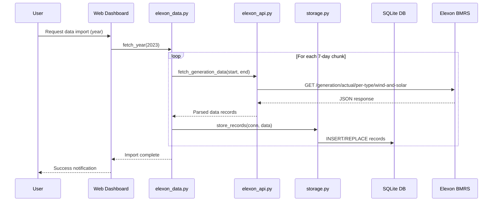
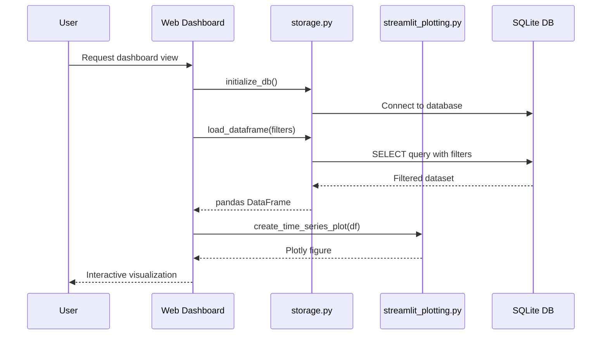
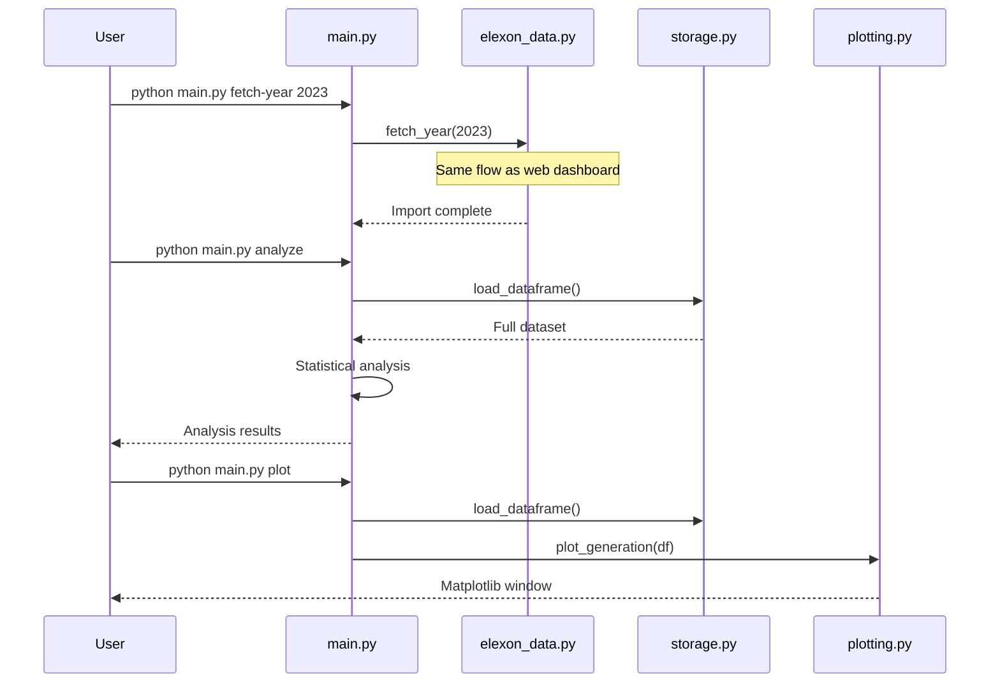

# Elexon Wind & Solar Generation Pipeline

## Purpose

This repository was prepared as part of my technical interview for the **Backend Developer** position at **Open Climate Fix (OCF)**.  The codebase demonstrates how I would design, document and deliver a production-ready data pipeline that ingests renewable-generation data from the Elexon BMRS API, stores it locally and exposes it through both a command-line interface and a Streamlit web dashboard.


## Tech Stack
* **Backend**: Python 3.9+, SQLite, pandas, requests
* **Visualization**: matplotlib, plotly, streamlit
* **Web Interface**: Streamlit dashboard with interactive charts
* **APIs**: Elexon BMRS (Balancing Mechanism Reporting Service)

## Project Structure
```
.
├── ocf_pipeline/          # Core library (configuration, API client, storage, analytics)
│   ├── config.py
│   ├── elexon_api.py
│   ├── elexon_data.py
│   ├── storage.py
│   ├── plotting.py
│   └── streamlit_plotting.py
├── main.py                # Command-line interface
├── streamlit_app.py       # Streamlit web dashboard
├── run.py                 # Convenience launcher
├── test_elexon_data.py    # Unit tests
└── docs/                  # Additional documentation
```

## Environment
Duplicate `.env` → `.env.local` if you need custom paths.
```bash
BASE_URL=https://data.elexon.co.uk/bmrs/api/v1/generation/actual/per-type/wind-and-solar
DB_PATH=elexon_generation.db
```

## Quick Start

### 🚀 Web Dashboard (Recommended)
```bash
# Install dependencies
pip install -r requirements.txt

# Launch web dashboard
python run.py

# Or directly with streamlit
streamlit run streamlit_app.py
```

The web dashboard provides:
- **📊 Interactive Dashboard**: Real-time metrics and visualizations
- **📈 Advanced Analysis**: Statistical analysis and pattern recognition  
- **🔍 Data Explorer**: Browse and filter raw data
- **⚙️ Data Management**: Import data with progress tracking
- **📱 Responsive Design**: Works on desktop, tablet, and mobile

### 🖥️ Command Line Interface
```bash
# Install dependencies
pip install -r requirements.txt

# Import a full calendar year (max 7-day windows internally)
python main.py fetch-year 2023

# Import specific date range
python main.py fetch-range 2023-01-01 2023-01-07

# Generate plots
python main.py plot --start 2023-06-01

# Perform data analysis
python main.py analyze

# Check database status
python main.py status

# Run tests
python main.py test
```

### 🛠️ Dependency Management
```bash
# Check dependencies
python run.py --check-deps

# Install missing dependencies
python run.py --install-deps
```

### 🐍 Python API
```python
# Import and analyze data programmatically
from ocf_pipeline.storage import initialize_db, load_dataframe
from ocf_pipeline.plotting import plot_generation
from ocf_pipeline import elexon_data as ed

# Import data
ed.fetch_year(2023)

# Load and visualize
auth_conn = initialize_db()
df = load_dataframe(auth_conn)
plot_generation(df)
```

## Features

### 🌟 **Web Dashboard Features**
- **Real-time Dashboard**: Live metrics, charts, and KPIs
- **Interactive Visualizations**: Plotly-powered charts with zoom, pan, hover
- **Advanced Analytics**: Correlation analysis, seasonal patterns, capacity factors
- **Data Management**: Progress-tracked data imports with background processing
- **Responsive Design**: Mobile-friendly interface that works on all devices
- **Data Export**: Download filtered datasets as CSV
- **Technology Comparison**: Side-by-side analysis of wind vs solar

### 🖥️ **CLI Features**
- **Batch Processing**: Import full years of data efficiently
- **Flexible Filtering**: Date ranges, technology types, custom queries
- **Statistical Analysis**: Automated reporting and insights
- **Data Quality**: Built-in validation and error handling
- **Testing Suite**: Comprehensive unit tests for reliability

## Architecture

### 🏗️ Core Components
```
┌─────────────────────────────────────────────────────────────┐
│                    USER INTERFACES                          │
├─────────────────────┬───────────────────────────────────────┤
│   Streamlit Web     │           CLI Interface               │
│   Dashboard         │           (main.py)                   │
│   (streamlit_app.py)│                                       │
└─────────────────────┴───────────────────────────────────────┘
                                │
                                ▼
┌─────────────────────────────────────────────────────────────┐
│                  APPLICATION LAYER                          │
├─────────────────────┬───────────────────┬───────────────────┤
│   Data Orchestration│   Configuration   │   Visualization   │
│   (elexon_data.py)  │   (config.py)     │   (plotting.py)   │
└─────────────────────┴───────────────────┴───────────────────┘
                                │
                                ▼
┌─────────────────────────────────────────────────────────────┐
│                   DATA ACCESS LAYER                         │
├─────────────────────┬───────────────────────────────────────┤
│   API Client        │       Storage Layer                   │
│   (elexon_api.py)   │       (storage.py)                    │
└─────────────────────┴───────────────────────────────────────┘
                                │
                                ▼
┌─────────────────────────────────────────────────────────────┐
│                   EXTERNAL SERVICES                         │
├─────────────────────┬───────────────────────────────────────┤
│   Elexon BMRS API   │       SQLite Database                 │
│   (External)        │       (Local Storage)                 │
└─────────────────────┴───────────────────────────────────────┘
```

### 🔄 Data Flow

#### 1. Data Ingestion Flow


#### 2. Data Visualization Flow


#### 3. CLI Operations Flow


## 📁 Module Breakdown

### 1. **config.py** - Configuration Management
```python
# Responsibilities:
- Load environment variables from .env file
- Provide default configuration values
- Centralize API endpoints and database paths

# Key Functions:
- load_dotenv(): Load environment configuration
- BASE_URL: Elexon BMRS API endpoint
- DB_PATH: SQLite database file path
```

### 2. **elexon_api.py** - API Client Layer
```python
# Responsibilities:
- Handle HTTP requests to Elexon BMRS API
- Manage API rate limits and timeouts
- Parse and validate API responses
- Handle error conditions gracefully

# Key Functions:
- fetch_generation_data(start, end): Core API call function
- Error handling for network issues
- Response validation and parsing
```

### 3. **storage.py** - Data Persistence Layer
```python
# Responsibilities:
- Manage SQLite database connections
- Handle CRUD operations on generation data
- Provide data filtering and querying capabilities
- Ensure data integrity and handle conflicts

# Key Functions:
- initialize_db(): Create database and tables
- store_records(): Insert/update generation records
- load_dataframe(): Query and filter data
```

### 4. **elexon_data.py** - Data Orchestration Layer
```python
# Responsibilities:
- Coordinate multi-day data imports
- Handle API window limitations (7-day chunks)
- Manage progress tracking for long operations
- Provide high-level convenience functions

# Key Functions:
- fetch_year(): Import full year of data
- Chunking logic for large date ranges
- Progress reporting capabilities
```

### 5. **streamlit_app.py** - Web Interface Layer
```python
# Responsibilities:
- Provide interactive web dashboard
- Handle user input and form validation
- Manage application state and caching
- Coordinate visualization and analysis features

# Key Components:
- Dashboard tab: Real-time metrics and charts
- Analysis tab: Advanced analytics and filtering
- Data Explorer: Raw data browsing and export
- Data Management: Import controls and progress tracking
```

### 6. **main.py** - CLI Interface Layer
```python
# Responsibilities:
- Parse command-line arguments
- Execute batch operations
- Provide scriptable interface for automation
- Handle CLI-specific error reporting

# Key Commands:
- fetch-year: Import yearly data
- fetch-range: Import date range
- plot: Generate visualizations
- analyze: Statistical analysis
- status: Database information
```

## 🔧 Technical Implementation Details

### Database Schema
```sql
CREATE TABLE generation (
    publish_time TEXT,
    business_type TEXT,
    psr_type TEXT,           -- Technology type (Wind Onshore, etc.)
    quantity REAL,           -- Generation in MW
    start_time TEXT,         -- Timestamp for the measurement
    settlement_date TEXT,    -- Settlement date
    settlement_period INTEGER,
    PRIMARY KEY (psr_type, start_time)
);
```

### API Integration
- **Endpoint**: `https://data.elexon.co.uk/bmrs/api/v1/generation/actual/per-type/wind-and-solar`
- **Rate Limits**: Managed through chunking and delays
- **Window Limit**: Maximum 7 days per request
- **Format**: JSON responses with nested data structure
- **Timeout**: 30 seconds per request

## 🧪 Testing Strategy

### Unit Tests (`test_elexon_data.py`)
- **API Mocking**: Mock external API calls for reliable testing
- **Database Testing**: In-memory SQLite for isolated tests
- **Data Validation**: Ensure data integrity throughout pipeline
- **Error Scenarios**: Test error handling and edge cases

### Integration Testing
- **End-to-End**: Full workflow from API to visualization
- **Cross-Module**: Ensure proper module interaction
- **Performance**: Monitor execution times for large datasets# OCF-task
